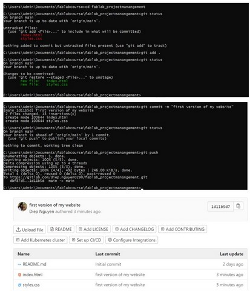

# 2. Project management

2nd day of week 1, I worked on configuring HTML, VCS (GITLAB, GITHUB) and started to get used to the documentation process.
To be honest, I did not get familiar with the term "documentation", because in my faculty, we usually use "learning journal" instead. Therefore, if you have similar feeling, you can think it simply as document or make diary of whatever you have learnt. 
Another thing is that, while studying the materials/ watching tutorials, I usually used screen-capture and pasted all the photos into my Onenote for later easy documentation.

## HTML, CSS, JavaScript
Normally, a website includes 3 main parts: HTML (content and structure), CSS (style, e.g. colors, elements positions, and text sizes) and Javascript (provide interaction with the users)

1.HTML

> The HyperText Markup Language, or HTML is the standard markup language for documents designed to be displayed in a web browser. It can be assisted by technologies such as Cascading Style Sheets (CSS) and scripting languages such as JavaScript.[Wikipedia](https://en.wikipedia.org/wiki/HTML).

To create a basic website, all we need is a basic text editor (such as Notepad, or Notepad ++). Of course we can consider other applications including: Sublime text, Visual studio go, Brackets...

Once having a text editor installed in your laptop, we need to know about the [Anatomy of HTML elements] (https://developer.mozilla.org/en-US/docs/Learn/HTML/Introduction_to_HTML/Getting_started). 

(which look like syntax with heading and ending signal) and write what we want to show in our website.

I wrote my first website in the Notepad ++ and named it "index.html"

in website interface, it looks like this


2.CSS

> Cascading Style Sheets (CSS) is a style sheet language used for describing the presentation of a document written in a markup language such as HTML.[wikipedia](https://en.wikipedia.org/wiki/CSS).

To create *style* for what we wrote, we need to have another text document featuring the styles we want.
For example, I want my header will be in red. I will write the rule like this to a new text document, and name it styles.css
> h1 {
  color: red;
}

To link the style to index.html, we need to write a rule <link rel="stylesheet" href="styles.css"> inside the <head> of our index.html
 
 and it will show in website as below
 

3.JavaScript would not be our focus in this course but it is about the interactions/behaviors for users such as a list down menu... 


## VCS (Version Control System) - Gitlab vs Github

VCS is a software which records changes, permits recall older versions, and enables collaboration. Among VCS softwares, we choose GIT (Gitlab, Github) due to its free, simple, fast, and open platform.

Since the main aim of this week is to **have my own website deployed in class repository (either gitlab or github)**, so we need to:

1. Have an account in gitlab or github and create a new project. This will be the place we store our website.

2. Setup GIT in my computer (install from <https://git-scm.com/downloads>, and *configure git* with my name and email address)


3. Generate SSH keys: we need these keys to authenticate ourselves with the system so that it knows we are the one who owns the project.

- We have 2 types of SSH keys: private key (which will store in our local file), and public key (which everyone can see and get)

- To create SSH keys: I type the command *ssh-keygen -t rsa -C "your.email@example.com" -b 4096* into the Git CMD


Then it will generate the 2 keys in my local repo.


To pair up with the remote repo in gitlab, we need to open the file .pub in text document


and copy it into our gitlab project (Preferences/SSH Keys)


4. Download the remote repository to our computer (creating a local repository), we need to clone it by using *git clone url*

To get the URL, we need to go to our project created in gitlab, and copy it to the command


In the Git CMD, I had trouble on pasting the SSH URL, so I tried with the HTTPS and it worked.


After that, in our local repo, you will find a README text documentation, and that means we have successfully linked to the local repo from the remote repo.
Now, we can add our index.html and styles.css to the local folder.


5. Update the remote repo: any changes or modification from the local repo need to be updated so as to see in the remote repo. In the GIT CMD

```
git status => to check the status of the remote repo
git add . => to add any changes
git commit -m "message" => to commit/confirm our modification
git push => to update and move the changes to remote repo
```


