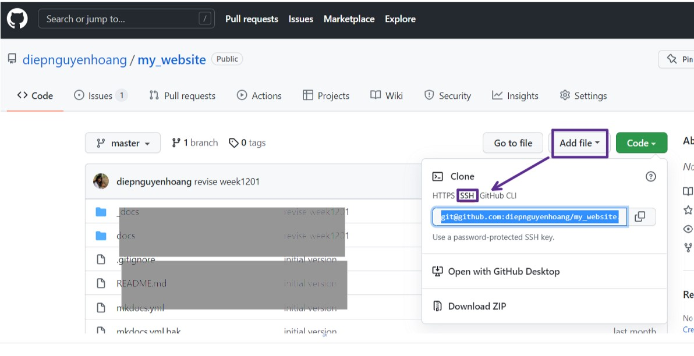

# 2. Project management

2nd day of week 1, I worked on configuring HTML, VCS (GITLAB, GITHUB) and started to get used to the documentation process.
To be honest, I did not get familiar with the term "documentation", because in my faculty, we usually use "learning journal" instead. Therefore, if you have similar feeling, you can think it simply as document or make diary of whatever you have learnt. 
Another thing is that, while studying the materials/ watching tutorials, I usually used screen-capture and pasted all the photos into my Onenote for later easy documentation.

## HTML, CSS, JavaScript
Normally, a website includes 3 main parts: HTML (content and structure), CSS (style, e.g. colors, elements positions, and text sizes) and Javascript (provide interaction with the users)

1.HTML

> The HyperText Markup Language, or HTML is the standard markup language for documents designed to be displayed in a web browser. It can be assisted by technologies such as Cascading Style Sheets (CSS) and scripting languages such as JavaScript.[Wikipedia](https://en.wikipedia.org/wiki/HTML).

To create a basic website, all we need is a basic text editor (such as Notepad, or Notepad ++). Of course we can consider other applications including: Sublime text, Visual studio go, Brackets...

Once having a text editor installed in your laptop, we need to know about the *Anatomy of HTML elements* <https://developer.mozilla.org/en-US/docs/Learn/HTML/Introduction_to_HTML/Getting_started> (which look like syntax with heading and ending signal) and write what we want to show in our website.

I wrote my first website in the Notepad ++ and named it "index.html"


in website interface, it looks like this


2.CSS

> Cascading Style Sheets (CSS) is a style sheet language used for describing the presentation of a document written in a markup language such as HTML.[wikipedia](https://en.wikipedia.org/wiki/CSS).

To create *style* for what we wrote, we need to have another text document featuring the styles we want.
For example, I want my header will be in red. I will write the rule like this to a new text document, and name it styles.css
> h1 {
  color: red;
}

To link the style to index.html, we need to write a rule <link rel="stylesheet" href="styles.css"> inside the <head> of our index.html
 
 and it will show in website as below
 

3.JavaScript would not be our focus in this course but it is about the interactions/behaviors for users such as a list down menu... 


## VCS (Version Control System) - Gitlab vs Github

VCS is a software which records changes, permits recall older versions, and enables collaboration. 
Among VCS softwares, we choose GIT (https://git-scm.com/) due to its free, simple, fast, and open VCS platform.
As learnt, there are 3 popular code hosting sites: GitHub, Bitbucket, GitLab. 
In this course, we focus more on GitHub and GitLab which are both web-based GIT repository hosting service with distributed revision control and social features.

Since the main aim of this week is to **have my own website deployed in class repository (either gitlab or github)**, so we need to do following steps:

1. **Create an account** in gitlab or github and **create a new project**. This will be the place we host our website.
In my case, I first chose GitLab to be my GIT repository manager.


2. **Setup GIT** in my computer (install GIT from <https://git-scm.com/downloads>, and **configure git** with my name and email address


3. **Generate SSH keys**: we need these keys to authenticate ourselves with the system so that it knows we are the one who owns the project.

	- We have 2 types of SSH keys: private key (which will store in our local file), and public key (which everyone can see and get)

	- To create SSH keys: I type the command *ssh-keygen -t rsa -C "your.email@example.com" -b 4096* into the Git CMD

	

	Then it will generate the 2 keys in my ssh configuration folder.

	

	To pair up with the remote repo in gitlab, we need to open the file .pub in text document

	

	and copy it into our gitlab project (Preferences/SSH Keys)

	

	

4. **Download the remote repository** to our computer (creating a local repository), we need to clone it by using *git clone url*

	To get the URL, we need to go to our project created in gitlab, and copy it to the command

	

	In the Git CMD, I had trouble on pasting the SSH URL, so I tried with the HTTPS as suggested from <https://gitlab.com/gitlab-org/gitlab-foss/-/issues/54518> and it worked.

	

	After that, in our local repo, you will find a README text documentation, and that means we have successfully linked to the local repo from the remote repo.
	Now, we can add our index.html and styles.css to the local folder.

	

5. **Update the remote repo**: any changes or modification from the local repo need to be updated so as to see in the remote repo. In the GIT CMD

	```
	git status => to check the status of the remote repo.
	git add . => to append one or more files to the commit that is being created.
	git commit -m "message" => to store the commit in local repo.
	git push => to update and move the changes to remote repo.
	```

6. Host/Deploy my website in GitHub

	I have been setting up using gitlab account, however, to facilitate the website deployment, we need to also set up CI/CD Pipelines which will help to automate our software delivery process. 
	Unfortunately, gitlab will ask us to fill in our credit card information in order to use this function. 
	It is a bit inconvenient for me to do so. 
	Therefore, I will I will choose GitHub as my code hosting site instead, which mean I have to set up all the things from the beginning (step 1,3&4), and create my website using Markdowns (not HTML). 
	
	- Create a new folder in my computer (local repository) for the website, here I named it as *fablabcoursehub*
	- Setup a new account and create a new repository (namedly *my_website*) in [GitHub](https://github.com/)
	- Generate SSH Keys in GitHub to authenticate myself with the system: in the *my_website* remote repo, go to Setting (at the top right corner of the web) > choose SSH and GPG Keys > New SSH Key
	
	

	I type the title for the key as *fablabprojectmanagementkey* and copy the SSH key that I created above (3) to share it with GitHub and click SSH Key.

	
	
	
	
	- Download the remote repo: in the newly created repository *my_website*, go to *Code* > choose SSH > copy the key URL > in the command line: type *git clone and paste the key in* 
	
	
	
	After the successful cloning, in my local repository *fablabcoursehub*, there is a folder named *my_website*
	
## Building a website with Markdown - MKDOCS

The website I am going to build is a **static web** which is built with much simple codes/language, allow simple navigation ... in comparison to dynamic web [Wiki](https://en.wikipedia.org/wiki/Static_web_page)

As such, a **static web generator** is needed. In my case, I will use **MkDocs**, which is a fast, simple and downright gorgeous static site generator that's geared towards building project documentation. 

Documentation source files are written in **Markdown**, which is a lightweight markup language for creating formatted text using a plain-text editor.[Wiki](https://en.wikipedia.org/wiki/Markdown)

1. First, since *mkdocs* requires [Python](https://en.wikipedia.org/wiki/Python_(programming_language)) (or pip), so I need to install the recent version of Python and then install *mkdocs* package using pip, following the [detailed guidelines](https://www.mkdocs.org/user-guide/installation/#installing-mkdocs)

2. Then I will copy the website template downloaded from the [Fabacademy_oulu](https://gitlab.com/fabacademy_oulu/students_template_site) to my local repo (folder *my_website*)

3. I remove the 2 files which I don’t need for GitHub
	
	
		
4. **Important note before starting to edit the web**
	
	- rename *docs* folder to *_docs* => anything we want to modify for our website in local repo will be excuted in this folder.
	
	- create new folder and name it: *docs* => do not touch this folder, this will store data generated from the remote repo.
	
	- open mkdocs.yml in notepad++ => change to relevant information, such as: site name... and especially docs_dir: change from "docs" to "_docs", and site_dir: change from "site" to "docs"
	
	
	
	- Push the local repo to the remote repo using the guideline below. Make sure you are in the correct directory of the website in command line
	
	
	After the git push, our remote repo should show the similar files as our local repo.
	
	
	
	- At this stage, there will be one folder *docs* missing in the remote repo. Here, we need to go to the Setting in our github project, choose Pages
	
	
	
	Go to command line (not git cmd), tell the system to build docs file => type mkdocs build
	
	
	Git status
	
	
	Git add .
	
	
	Git commit
	
	
	Git push
	
	
	We will finally have linked the file "docs" from local repo to remote repo
	
	
Any modification is done later in local repo must be updated in remote repo following mkdocs build > git status > git add > git commit > git push.
	
- Go to Docs to edit the index.html (home page) and other pages if you want	

	

	