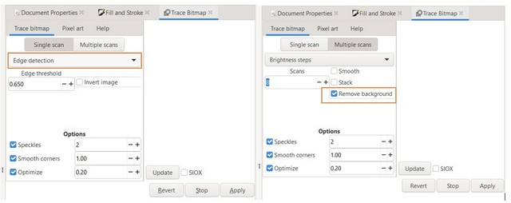

# 3. Computer Aided design

In this week, I have been introduced various types of computer-aided design tools for making 2D and 3D prototypes.

## Aim of this week

- Evaluate and select 2D and 3D software.
- Demonstrate and describe processes used in modelling with 2D and 3D software eg. 2D raster, 2D vector and 3D modelling processes.
- Model (raster, vector, 2D, 3D, render, animate, simulate, ...) a possible final project, compress images and videos.

## 2D Design

There are 2 types of 2D graphics: raster graphics and vector graphics. While raster images are in pixels, vector graphics are in geometric primitives (lines, curves)
Most photos are in raster images (tiff, jpeg, gif, pcx, bmp), vector graphics are usually in ai, eps, svg, pdf format.
With processing 2D graphics, I have explored GIMP & INKSCAPE software.

### GIMP

I have designed a snowflake using GIMP following <https://www.youtube.com/watch?v=6VWn1qO0irE>

- Create a new image, remmember to set the view *Show grid* for better calculation

- Choose *ellipse* to draw a circle and check on the option of *Expand from center*

- Choose *Paintbrush tool/Pencil* , and its color (I chose purple) to draw the first line vertically from the center. To make it straight, draw a dot in the center, press *shift*, then draw to the edge of the circle

- Press *shift+R* to open a *Rotate*, input *30* to the *Angle* because I would like to make a snowflake with 12 petals. Do the same for 11 remaining petals

- In *layer*, choose to create a new layer (I named it layer 1), remmember to choose *Fill with transparency* 

- Draw a new circle and 3 lines overlapped with the previous lines but with black color

- Choose *Paintbrush tool/Pencil* with different sizes and mark on the black lines. This will later create a shape of a snowflake petals

- Choose *Erase tool* and its size to remove/sharpen the petals

- After removing the previous layer (layer with purple lines), we have a snowflake as below.

### INKSCAPE

I used Inkscape to create my sticker.

- Firstly, I downloaded a picture from the internet <https://www.wallpaperbetter.com/en/hd-wallpaper-gbnmu>

- Then I imported it to Inkscape

	
	
- Because I only want to get the fish next to the mermaid, so I right-clicked to the picture and chose Trace bitmap.

	
	
- By using this, I could detect the edge in "Single scan" option, and remove background in "Multiple scans" option.

	
	
- I pressed *Apply* and got the result with black and white characters.

	

- I then went to *Path* > *Break apart* to scatter the big pictures to smaller ones. 

	

	This will allow me to see all the details of the fish and choose to group the correct ones.
	
	

- I selected all elements of the fish and clicked *Object* to setup the "Fill and Stroke*

	
	
- Then I drew a circle around the fish and chose the corresponding Fill and Stroke*
	
	

- After that, I selected Text to type what I wanted for the sticker, and chose Text > Put on path to connect the text with the circle.

	
	
- Finally, I selected the desired direction for the text to be in the cirle.

	

Overall, I find using Inkscape is a bit more convenient and easier to understand for me, because to this level, I don't have to deal with some kinds of layer (as in GIMP) which sometime confused me.

## 3D Design

### Fusion 360

I experienced with Fusion 360 on modeling a base to fit on the handlebar (of a bike) so as to keep the flashlight

1. In Fusion360, I *create sketch* and choose the Top surface. In the Create tab, I choose to draw a rectangle (90x50mm)

	
	
2. Then I choose *Fit point spline* to create a slot on the retangle's length.

	
	
3. I use *Trim* to cut the inner side of the slot

	
	
4. I continue to draw another small circle (18mm in diameter) to the other side of the rectangle, and use *Trim* to remove the inner side

	
	
	
5. Finally, I finish the sketch and *Extrude* it to 3D.

	
	

To be honest, it was my first time working on Fusion 360, so it was quite a bit confused in selecting different functions/shapes. 
Also, for me, the hardest part is the ability to imagine different perspectives or surface so as to draw the desired shape (for example, what it will look like from the back, top, or the front)

## Origin files

[2D Sknowflake design](../assets/snowflake1.svg)

[2D Sknowflake PDF](../assets/snow.pdf)

[2D Fish design](../assets/fish.svg)

[2D Fish PDF](../assets/Fish.pdf)

[3D design](../assets/Base.svg)

[3D design universial](../assets/Base.stl)