# 4. Computer controlled cutting

This week I worked on the processes involved in using vinyl cutter and laser cutter in Oulu Fablab.

# Aims

- Cut anything with vinyl cutter (Individual)
- Characterize laser cutter (Group)
- Make a parametric press-fit construction kit with laser cutter and demonstrate the process (Individual)


## Vinyl cutting

### Preparing the design
I chose to use Inkscape for design preparation

- I firstly download my favorite image since I am not good at drawing <https://www.vecteezy.com/vector-art/4988938-flying-beauty-pink-butterfly>
- In the Inkscape, I go to *Files > Import* and choose the downloaded image 
- Then I use *trace bitmap* in Inkscape because the vinyl cutter files must only contain vectors (and images we downloaded are mostly raster). So I will right click the image and select Trace bitmap, or go to tab Path > Trace bitmap, or Shift + Alt + B. In the pop-up window of Trace Bitmap, choose Edge detection, and it converts as below


- Next, I would need to *draw a rectangle* around the image as a frame. By doing this, it will be much easier for later peeling. Here I have problem when drawing a rectangle because it just showed the dot lines of the frame instead of the visible straight lines. So I tried to check the *Fill and Stroke* of the rectangle, and it should be flat color in stroke paint, and no color in Fill instead.


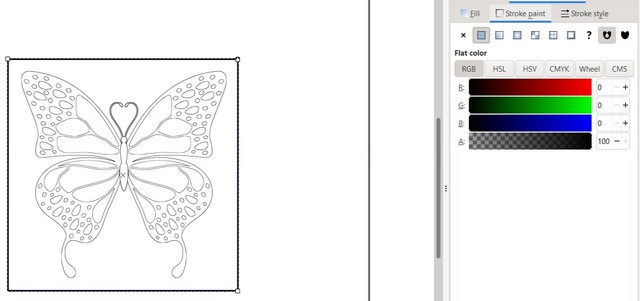

- Then I *Ctrl A* to choose all (a butterfly and a rectangle) and go to File > Document Properties > Resize page to drawing


- Next I need to configure the Fill and Stroke of the whole image (select all > click Object > Fill and Stroke) , I chose X (no color) for the Fill, Flat color for the Stroke paint, and 0.02mm width for the Stroke style


Then this picture is ready to print. But I prepared it at home, so I need to copy it in .svg format to memory stick and go to Fablab to print

### Cutting with vinyl cutter

At the University of Oulu, we use  Roland CAMM-1 GS24 vinyl cutter.


>	1. Loading lever: we push it to the back to load the sheet and adjust the rollers, and pull it to the front to fix the position to cut. Remember that the lever should be in the front position (we can view as locked) when cutting. 
>	2. White strips are places where we should place the rollers.
>	3. There are 2 rollers which play as positioning the width of the sheet.
>	4. Cutting carriage: there is a very small blade installed here. The cutting will move from left to right to cut.
>	5. Operation Panel (on the right of the machine): there are 3 selections available for material a) roll:the machine will measure the distance between the rollers and is mostly used for the rolling cutting sheet b) piece: the machine will measure length and width of the sheet and c) edge: the machine will measure the distance between the rollers and moves the blade to the left edge of the sheet.


- For setting the vinyl cutter for my image, I chose **Edge** 
- Then I loaded the sheet under the rollers
- Back to the computer, I opened my image in Inskcape, and moved my image to CutStudio by choosing *Extention* tab > Roland CutStudio > Open in CutStudio.


- In CutStudio, I pressed Ctr P to print (remember to choose the correct cutting machine)


- Back to the Operation Panel, I pressed Enter to start cutting.


- Since the image I chose has so many small details, the machine somehow peeled it while cutting.

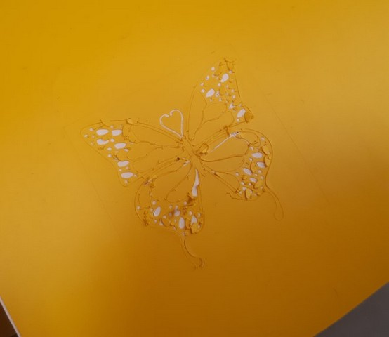

- I would better choose another good example to demonstrate the vinyl cutting later, now I just sticked with it and try to peel it (I used a tweezer to help me). You can see some details in my cutting have to be sacrified.

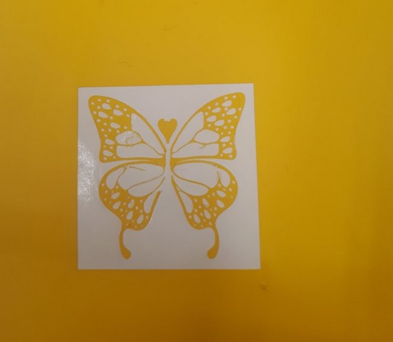

- After removing the unwanted parts, I used a piece of paper adhesive sheet to help moving my sticker to the desired place


- I sticked it on my laptop


Apparently, we should consider the details of our image when vinyl cutting. So this time, I chose another better one, and repeated the above steps


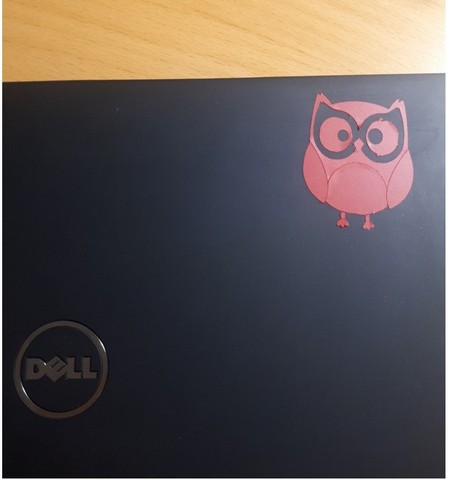


## Characterizing laser cutter

For understanding the nature and features of the laser cutter, as a group of four (Kecheng Zhang, Antti R, Antti Pantti and me), we worked mostly with Epilog Fusion M2 40 Laser 75 Watt which is larger than the other mini laser cutter.

### With the machine

- Turn on: there are 3 steps to turn on the machine

- Star cutting: assume that we have a design and already send to the machine, then we need adjust 3 things on the Joystick Control

		○ JOG: (or the Origin)  is where we set up the place/point where the machine begin to laser. By looking at the Red dot pointer and using the joystick to move it to the desired position
		
		○ FOCUS: is where we decide the distance between the laser and the material we neet to cut. Normally, we have a special focusing tool (triangle shape) to support the adjustment. By installing the tool to the 2 knobs of the laser, and moving (up or down) the joystick until the tool touches the material, take out the tool after setting.
		
		○ JOB: is where we choose the file we need to implement 

- Remember that after each adjustment, we need to press the joystick so that the system can save our setting.

- After the 3 setting, the screen will display the amount of time spending for the job.

- Click GO to start cutting/engraving
	
### Important safety instructions: 


```
Since the laser cutter is the most dangerous machine in any Fablab, so we should:
○ NEVER Turn our back to the machine when it is cutting
○ Wait at least 1 minute after the machine finishes the cutting, and open the lid. Because the combution of some cutting materials may catch fire when exposing with air, so we need to wait for the exhaust pull away the gases
○ In case there is fire, (1) cover the place with the 'fire blanket' (near the sink in the Fablab), (2) bring the material out of the machine, (3) use the fire extinguisher.
```

### Kerf

#### What is kerf: 
It is the width of material which is burned away. That mean the size of what we design to cut and of what we cut in reality will slightly mismatch. This happens because of many factors such as the laser beam has its own size, the nature of the materials, the environments, the settings, the process… It is important to take into consideration the kerf when designing, especially in parametric design.
The picture from our instructor (Ms. Behnaz) is a good demonstration to understand.


#### Measuring kerf
- To make it clearer, we prepared to cut the big rectangle with the length of 100 mm which has 10 small 10mm-rectangles inside. 

 

- The file was saved in pdf format before sending to the laser cutter.
- The material we used to cut is MDF 3mm and Acryclic 3mm.
- Then we measured the size of the big one and the small onces after cutting to see the difference. To make it easy to calculate, we also used 2-side taps to help position the material on paper, and made use of the digital calculator.
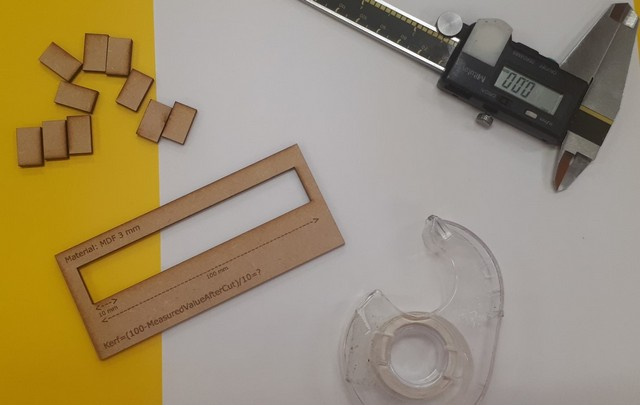 
- After cutting: Interestingly, both the MDF and the Acrylic demonstrated clearly the kerf. 
	- With MDF material: 
	
		□ The designed size for the big rectangle we wanted to cut is 100 mm, but the real size is 100.03 mm.
		
		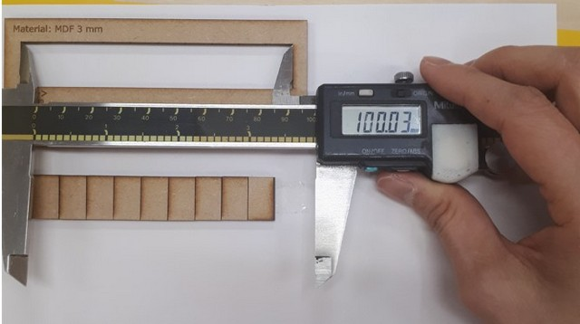
		
		□  Similarly, 10 small rectangles were set to be 10 mm each (which accounted for 100 mm whole), but the value after cutting for 10 small rectangles together is 98.70 mm.		
		
		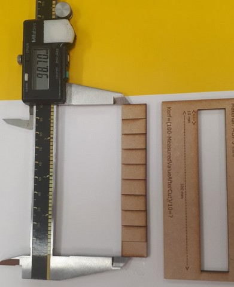 
		
		□  Here we can see the gap, and the Kerf we calculated is 0.13 mm.
		
		 
		
	- With Acrylic material: we observed that actual size of the 10 small rectangles are 98.98mm. As such the Kerf is 0.102mm for this case.
	
		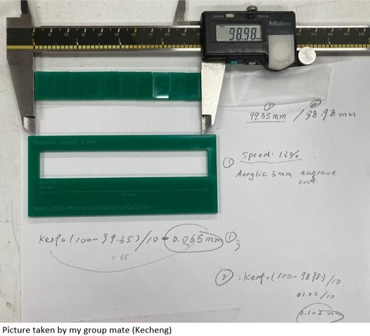

### Power - Speed - Frequency - DPI

For checking out the effect of Power, Speed, Frequency, DPI on the cutting/engraving quality, we used MDF 3mm and Acrylic 3mm to demonstrate this.

With the MDF 3mm: 

- Firstly, we keep the Frequency constant, and adjust the Power and Speed.

| Power | Speed | Freg 	| Observation |
|:-----:|:-----:|:-----:|:-----------|
|100	|15 	|20		|Cut thru |
|100	|`5`	|20		|Cut thru but very slow|
|100	|`40`	|20		|Not cut thru due to fast speed|
|`50`	|15 	|20 	|Not cut thru due to too low evergy|
|`80`	|15		|20		|Cut thru|

 

We observed that with slow speed, the machine works well in cutting through the material, while if we set the machine run fast, it hardly to cut. Additionally, with low power(50) MDF 3mm cannot be cut cannot cut but we can make use of this figure to engrave for example. Interestingly, with just 80% power, the square can be cut easily, which is a good consideration for power saving. 

- Next, we adjusted the frequency and keep the power (100) and speed (15) constant to see what would happen.
The frequency was changed from 20, 5, 40, 60, 80 but there were not so many differences we could observe, because all were well-cut.

 

- To check the engraving quality, we kept the Speed (50) and DPI (300) unchanged while adjusted the Power (from 20, 50, and 100). 
It is also important to note that the color of all 3 pictures should be the same or else it will not describe correctly the effect.
It can be clearly seen that with less power, the engraved parts are lighter than those of strong power.

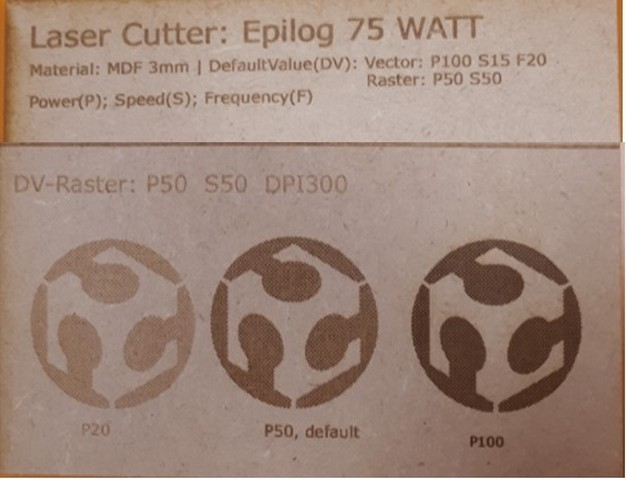 

#### 


## Making with laser cutter

In this assignment, I have to design and make a press-fit construction kit by my own. Most importantly, it should be parametric design without using Inkscape.
So that means I have to consider using 3D design software which is quite challenging for me as a newbie within a week. However, I decided to use Autodesk Fusion 360 since I already asked for the student account installation.
Anyway, with the support of my instructors and peers, I did it and can finally create a nice thing.

### Sketch a design

I firstly drew on paper what I wanted to make, and it is a pen holder. 
It will have 4 pillars (in rectangle-shape) to hold 4 disks (in circular-shape) with inside empty and 1 disk as a base.

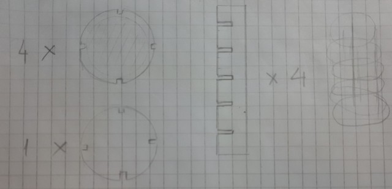 

### Design on Fusion 360

1. I click on **Create sketch** and choose a surface I want to draw. It was a TOP
2. In the *Create*, I choose a circle shape. It will then appear a small window of *Sketch palette* on the right hand, and I choose **Center diameter circle** to draw a circle from the central point.
	
	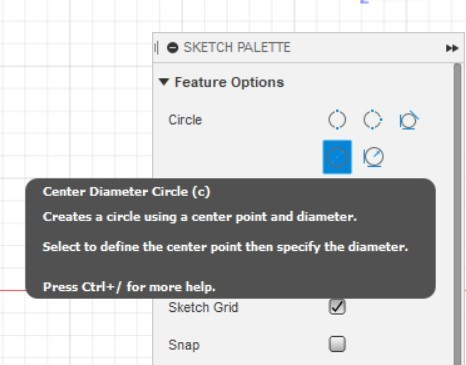

3. I input the diameter of the circle as **100mm**, and draw a smaller circle inside with 70mm in diameter.
	
	

4. Then I draw another smaller circle inside with **70mm** in diameter.
	
	

5. In the *Create*, I choose to draw **Rectangle** (2-point rectangle) inside the big circle. This will be made as a joint in a press-fit construction later. I temporarily set the height as 8mm and width as 3mm.
	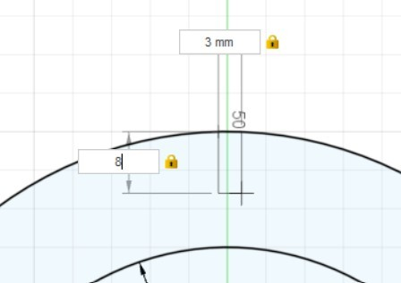

6. I need to define my own parameter so that it will be more convenient if later I want to change some dimensions which related to each other, they will be changed accordingly.

	- I go to *Modify*, select **Change Parameters**, click + and define parameter in my own words.
	- I especially choose the **Material_thickness** as 3mm because I plan to cut in the MDF 3mm. 
	- For the **Kerf**, I define it as 0.1mm because as we test above, the kerf for cutting joint slot with MDF 3mm is around 0.13mm. We can change it later if after cutting it does not fit.
	- I also define the **slot_width**=Material_thickness-Kerf.		

	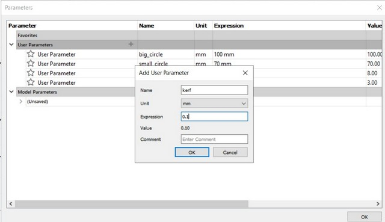

7. After clicking OK to set the parameters, I go back to the sketch and change the name of the dimensions. By double click on the dimensions, for example the 8mm of the slot, I will type slot_height.
I do the same for the other dimensions (big_cirle, small_circle, slot_width)

	

8. Next, to make a slot, I need to **Trimm** or remove (click on the scissor shape) the unnecessary parts of the rectangle.

	
	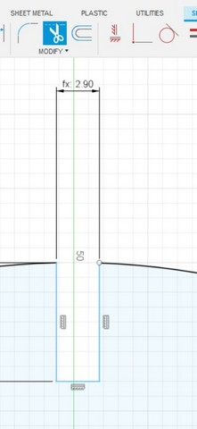

9. I need to make the slot height constrainted to make sure they will always fix and position. So in the tab **Constraint**, I choose the icon of equal (=), and click the 2 sides of the slot.

	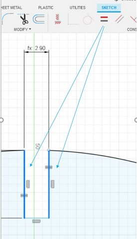	

10. Now I have 2 circles and a slot with constraint. It is nearly similar to my sketch, except I need 3 more slots. 
So here the instructor advices me to use a tool called **Circular Pattern** in the *Create* tab. This function will allow us to duplicate the sketch in an arc or circular pattern

	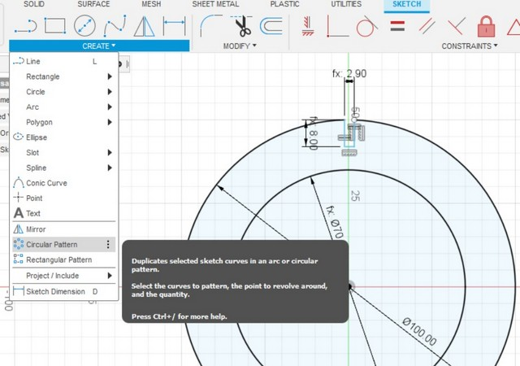

	As a *Circular pattern* window pops up, I do step by step as the guideline. First, for the *Object*, I select the 3 sides of the slot. Second, for the *Center Point*, I select the big circle. Then, I select Full for the *Angular Spacing* because I want the slots go around the circle. Finally, I choose 4 for the *Quantity*

	

	Now I have 4 slots on the big circle. But at the 3 new slots we need to trim the unwanted parts on the cirle to make it a slot.

	

	Since I make constraint for the first slot, so other slots duplicated from that will also constraint. To check that, I go to *Change parameters* and change the slot height as 9mm. When I back to the sketch, the slot height of other slot is also changed to 9mm (click on the height, press D - as Measurement, and drag it to see)

	

11. Now I move on to draw another part (a pillar for the pen holder). I **draw a rectangle** with 25mm width and 150mm height

	

12. On this rectangle, I also need to have slots (5 in total). So the steps will be quite similar as making slots for the circle above. I first draw a small rectangle, but this time, I put the name of the parameter I define before to the dimensions instead of the number.

	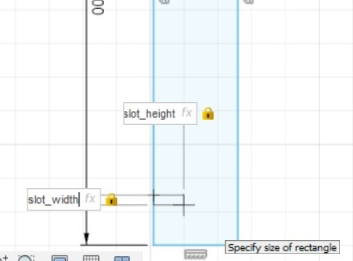

13. Then I do the **Trim** for the small rectangle to make a slot.
14. To duplicate the slot, I will use the same tip as above, but this time with **Rectangular Pattern**

	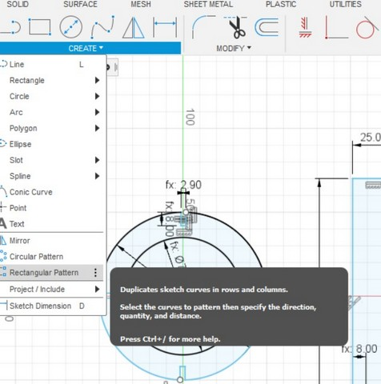

	In the rectangular pattern windown: For the *Object*, I select the 3 sides of the slot. Second, for the *Direction*, I select left side of the big rectangle. Then, I input 5 for the 1st Quantity because I want 5 slots. Then for the Distance, I am not quite sure, so I use the blue arrow appeared on the sketch and move it to the position I find comfortable. For the 2nd *Quantity*, it is the number of rectangles will be duplicated in the horizon direction, I don't need more than 1, so I put it 1.

	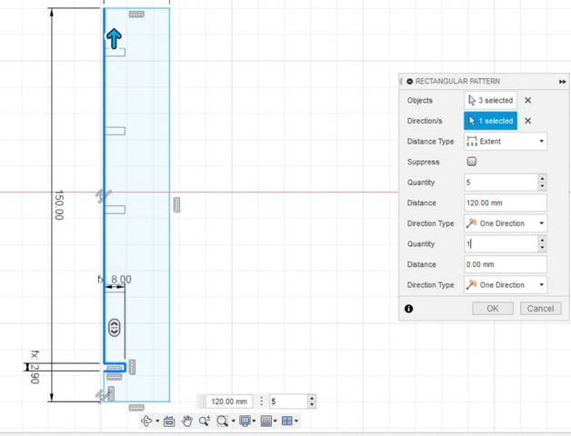

15. Now I have 5 rectangles on the pillar, just need to trim to make them slots. And finish the design

	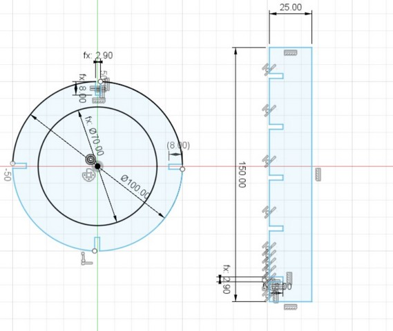


### Export to PDF with Fusion 360

1. To export to PDF, I need to **Extrude** the sketch to 3D. I click on *Finish Sketch*, and select all (both the cirle and the rectangle pillar).
Then I go to *Create* and choose *Extrude*. Here it will ask to input the thickness of my 3D, so I type 3 because the material I will use to cut is MDF 3mm.

	
	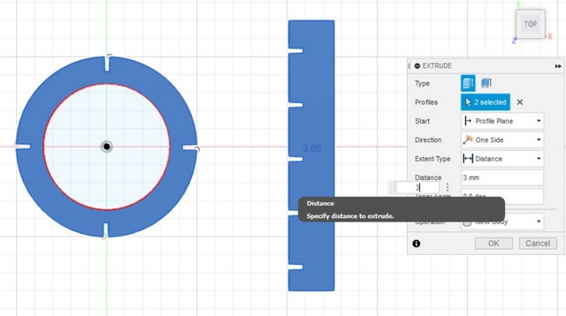

2. In the *Design* tab, I choose **Drawing > From Design**, and it will pop up a *Create Drawing* window, in which I select the Sheet size as A4

	

3. In the *Drawing view*, I change the **Orientation** to the **Top** and the **Scale** to **1:1**. Place the mouse to the drawing and OK.

	

4. To delete the outside frame and the title frame of the drawing, I go to Sheet setting and click on the eyes to make it invisible.

	

5. Now I will export to PDF and save it.

	

### Prepare to print with Inkscape

In the Inkscape, I import the pdf file, and set up the **Fill and Sroke** of the objects (Fill: no paint, Stroke paint: Flat color, Stroke styles: 0.02 mm)
It is not allowed to change the size in Inkscape because it will affect to the kerf and other dimensions.
Then, I will save it again in PDF. 

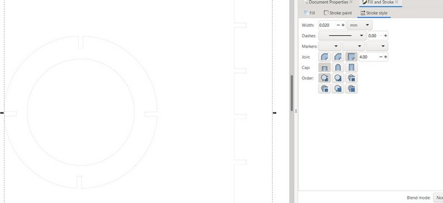

### Set up with laser cutter

1. I open the newly saved PDF and press Ctrl P. In the Epilog Properties, *Advanced* tab, I select the parameter for the materials *3mm_MDF_cut* and press OK to send the job to the laser cutter

	
	

2. Back to the laser cutter, I adjust the Jog, Focus, and Job. It was so satisfied to see my design is coming true.

	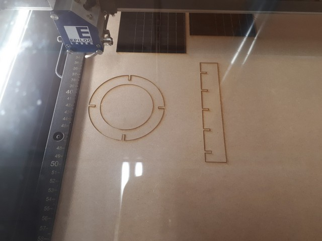

	After that, I test the joints connection and see they fix quite well. So I decide to make more by copying the images in Inkscape, and do again with the Fill and Strokes...

	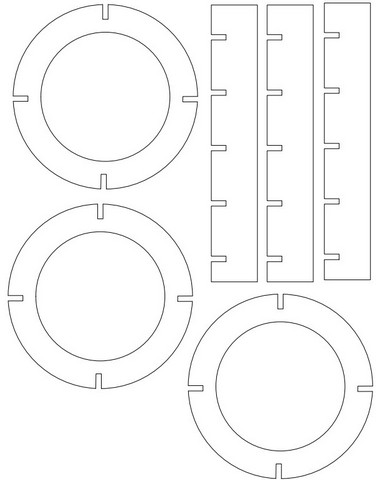
	

	Additionally, I would need to have another circle as a base (without being empty inside), so I back to my sketch in Fusion 360, select the smaller circle and extrude it. Then I export it to PDF, adjust the Fill and Stroke in Inkscape, Save in PDF, and send to laser cutter to print.

	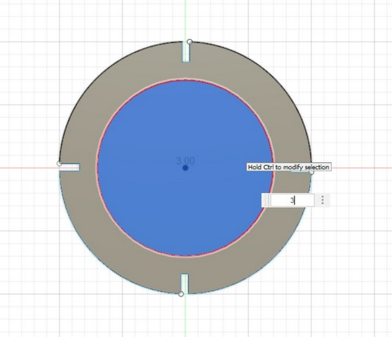
	

### Assemble the construction kit

Now I have all objects I need and it is time for assemblingggg

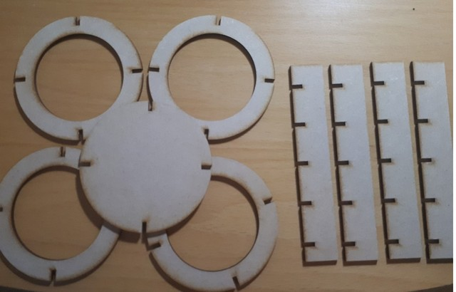
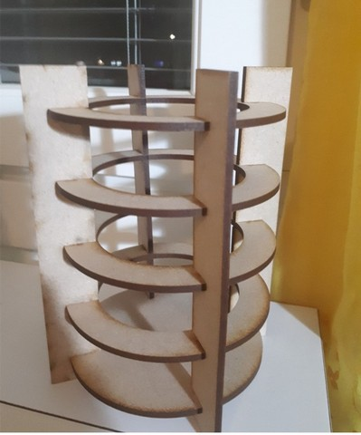
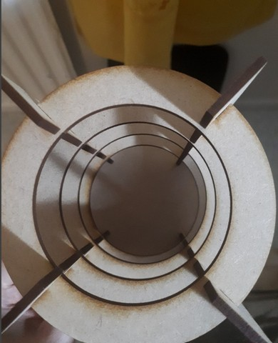

It can hold the pens or "assemble other ways" to connect with other press-fit construction kits

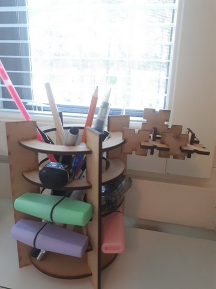


### Original Designed files

[download my image](../images/week04/fusion35.jpg)